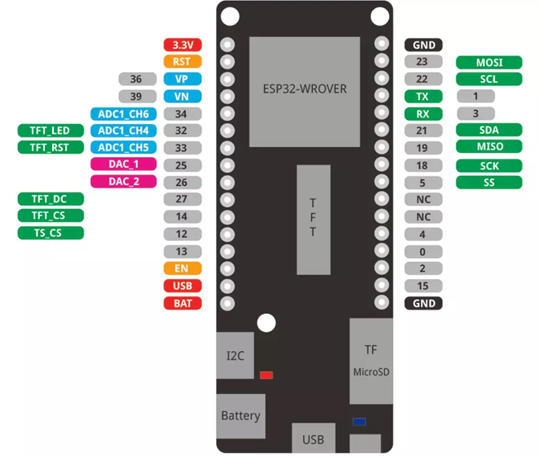
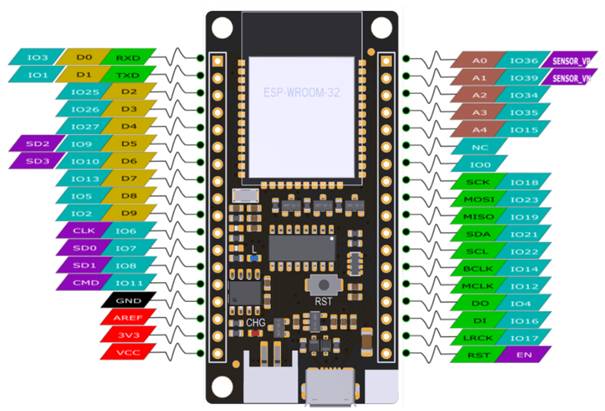
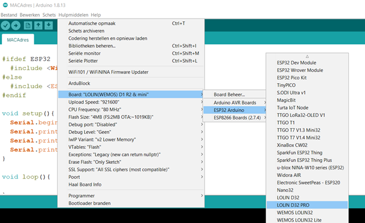
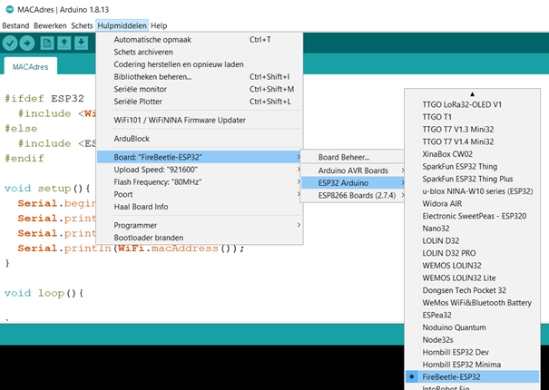
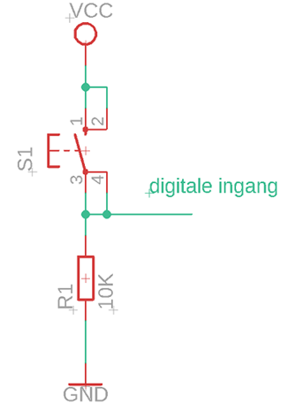

# ESP32

## Algemeen

De ESP32 is net als de ESP8266 een microcontroller van ESpressif. Enkele
kenmerken van de ESP32 zijn:

-   Dual core 32-bit microprocessor
-   Draadloze Wifi communicatie 802.11 b/g/n
-   Bluetooth communicatie
-   12-bit SAR ADC (Successive approximation analog to digital convertor)
-   8 bit DAC (digital tot analog convertor)
-   SPI-bus (Serial Peripheral Interface)
-   I²C-bus (Inter-IC-bus) Spreek uit als I kwadraat C bus
-   PWM-modules (Pulse-width modulation)

Er worden door verschillende fabrikanten ontwikkelbord met de ESP32
verkocht. Enkele veel voorkomende borden zijn:

Wemos D32-Pro V2 <https://www.wemos.cc/en/latest/d32/d32_pro.html>

Leverancier:
<https://opencircuit.nl/Product/Wemos-D32-Pro-V2.0.0-ESP32-CH340C-16MB-Flash>



FireBeatle ESP32 van dfrobot
<https://wiki.dfrobot.com/FireBeetle_ESP32_IOT_Microcontroller(V3.0)__Supports_Wi-Fi_&_Bluetooth__SKU__DFR0478>

Leverancier:
<https://opencircuit.nl/Product/FireBeetle-ESP32-IoT-Microcontroller>



De ESP32 kan zowel geprogrammeerd worden in C met arduino IDE als met micropython. In deze cursus opteren we voor arduino IDE.

## Arduino IDE

De ESP32 is niet standaard aanwezig in arduino IDE. Toevoegen kan via:

<https://randomnerdtutorials.com/installing-the-esp32-board-in-arduino-ide-windows-instructions/>

Te kiezen bord bij Wemos D32-Pro V2:



Te kiezen bord bij FireBeatle ESP32 van dfrobot:



## Knipperled

Voorbeeldprogramma met delay's:

```cpp
void setup() {
  // initialize digital pin LED_BUILTIN as an output.
  pinMode(LED_BUILTIN, OUTPUT);
}

// the loop function runs over and over again forever
void loop() {
  digitalWrite(LED_BUILTIN, HIGH);   // turn the LED on (HIGH is the voltage level)
  delay(1000);                       // wait for a second
  digitalWrite(LED_BUILTIN, LOW);    // turn the LED off by making the voltage LOW
  delay(1000);                       // wait for a second
}

```

Voorbeeldprogramma zonder delay's:

```cpp
unsigned long previousMillis = 0;       //laatste maal toestandsverandering
unsigned long currentMillis = 0;       //tijd sinds opstart arduino

boolean ledState = LOW;                // ledstatus

const long interval = 1000;           // interval in milliseconden
const int ledPin =  LED_BUILTIN;      // pin nummer van de ingebouwde led

void setup() {
  Serial.begin(115200);
  pinMode(LED_BUILTIN, OUTPUT);
}

void loop() {
  currentMillis = millis();
  if ((currentMillis - previousMillis) >= interval) //wanneer verschil tussen laatste toestandsverandering en opstarttijd groter of gelijk is aan interval
  { ledState=!ledState;
    previousMillis = currentMillis;    //update previousMillis
    digitalWrite(LED_BUILTIN,ledState);
    Serial.println(ledState);
  }

}
```

Opdrachten:

-   Zoek in de documentatie de pin van de ingebouwde led op het bord op. Laat de ingebouwde led knipperen.
-   Plaats een externe led en laat deze knipperen.
-   Laat 2 leds afwisselend knipperen.

## Weergave seriële monitor

Voorbeeldprogramma

```cpp
void setup() {
Serial.begin(115200);
}

void loop() {
delay(1000);
Serial.println("hello from ESP32");
}
```

Opdracht:
-   Test bovenstaande programma.

## Digitale ingang

Sluit volgende schakeling aan op een zelfgekozen ingang



Voorbeeldcode

```cpp
#define drukknopPin 4

boolean drukknopStatus;

void setup() {
 pinMode(drukknopPin, INPUT); // pin 12 als ingang plaatsen
 Serial.begin(115200);
}

void loop() {
  drukknopStatus = digitalRead(drukknopPin); //binnenlezen toestand ingang
  Serial.println(drukknopStatus);
}
```

Opdrachten:
-   Test de voorbeeldcode met de drukknop uit.
-   Laat een led oplichten wanneer de drukknop ingedrukt is.
-   Sluit 2 drukknoppen aan. De ene drukknop is de start drukknop de andere de stopdrukknop. Laat een led oplichten wanneer de startdrukknop ingedrukt is.

## Analoge invoer

De ESP32 beschikt over een 12 bit ADC.

Voorbeeldprogramma

```cpp
int sensorPin = A6;    // select the input pin 
int sensorValue = 0;  // variable to store the value coming from the sensor

void setup() {
  // declare the ledPin as an OUTPUT:
  Serial.begin(115200);
}

void loop() {
  // read the value from the sensor:
  sensorValue = analogRead(sensorPin);
  Serial.print("Sensorwaarde: ");
  Serial.println (sensorValue);
  delay(100);
}
```

## DHT11 temperatuur- en luchtvochtigheidssensor

De data wordt digitaal verzonden van de DHT11 naar de arduino.

De aansluitpinnen:


Voorbeeldprogramma:

```cpp
#include "DHT.h"
//here we use 14 of ESP32 to read data
#define DHTPIN A13
//our sensor is DHT11 type
#define DHTTYPE DHT11
//create an instance of DHT sensor
DHT dht(DHTPIN, DHTTYPE);
void setup()
{ Serial.begin(115200);
  Serial.println("DHT11 sensor!");
  //call begin to start sensor
  dht.begin();
}

void loop() {
  //use the functions which are supplied by library.
  float h = dht.readHumidity();
  // Read temperature as Celsius (the default)
  float t = dht.readTemperature();
  // Check if any reads failed and exit early (to try again).
  if (isnan(h) || isnan(t)) {
    Serial.println("Failed to read from DHT sensor!");
    return;
  }

  // print the result to Terminal
  Serial.print("Humidity: ");
  Serial.print(h);
  Serial.print(" %t");
  Serial.print("Temperature: ");
  Serial.print(t);
  Serial.println(" *C ");
  //we delay a little bit for next read
  delay(2000);
}
```

## MAC-adres

Voorbeeldcode om het mac-adres weer te geven

```cpp
#include <WiFi.h>

void setup(){
  Serial.begin(115200);
  Serial.println();
  Serial.print("ESP Board MAC Address:  ");
  Serial.println(WiFi.macAddress());
}

void loop(){
}
```

## Overzicht beschikbare wifi netwerken

```cpp
#include "WiFi.h"

void setup() {
  Serial.begin(115200);
  // Set WiFi to station mode and disconnect from an AP if it was previously connected
  WiFi.mode(WIFI_STA);
  WiFi.disconnect();
  delay(100);
  Serial.println("Setup done");
}

void loop() {
  Serial.println("scan start");
  // WiFi.scanNetworks will return the number of networks found
  int n = WiFi.scanNetworks();
  Serial.println("scan done");
  if (n == 0) {
    Serial.println("no networks found");
  } 
 else {
    Serial.print(n);
    Serial.println(" networks found");
    for (int i = 0; i \< n; ++i) {
      // Print SSID and RSSI for each network found
      Serial.print(i + 1);
      Serial.print(": ");
      Serial.print(WiFi.SSID(i));
      Serial.print(" (");
      Serial.print(WiFi.RSSI(i));
      Serial.println(")");
      delay(10);
    }
  }

  // Wait a bit before scanning again
  delay(5000);
}
```


## Verbinding met WPA2 personal en weergave IP-adres

De ESP wordt in station mode verbonden met een WPA2 personal netwerk.
Het IP-adres wordt weergegeven.

Meer info over station mode:
<https://nodemcu.readthedocs.io/en/release/modules/wifi/>


Voorbeeld:
```cpp
#include <WiFi.h>

#define WIFI_SSID "SSID"  //SSID WPA2 personal wifi netwerk
#define WIFI_PSK "PASWOORD" // paswoord WPA2 personal wifi netwerk

void setup() {
  // put your setup code here, to run once:
  Serial.begin(115200);
  Serial.println("WIFI:\tsetup");
  WiFi.mode(WIFI_STA); //Station mode
  Serial.print("\tconnecting ");
  WiFi.begin(WIFI_SSID, WIFI_PSK);
  while (WiFi.status() != WL_CONNECTED) {
    delay(250);
    Serial.print(".");
  }
  Serial.print("\n\tGot wireless IP: ");
  Serial.println(WiFi.localIP());
}

void loop() {
  // put your main code here, to run repeatedly:

}

```

Bron:

<https://nl.wikipedia.org/wiki/ESP32>


