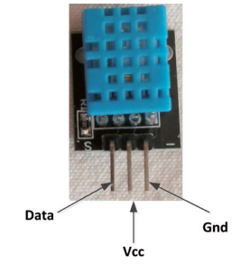

# ESP32

## Algemeen

De ESP32 is net als de ESP8266 een microcontroller van ESpressif. Enkele
kenmerken van de ESP32 zijn:

-   Dual core 32-bit microprocessor
-   Draadloze Wifi communicatie 802.11 b/g/n
-   Bluetooth communicatie
-   12-bit SAR ADC (Successive approximation analog to digital convertor)
-   8 bit DAC (digital tot analog convertor)
-   SPI-bus (Serial Peripheral Interface)
-   I²C-bus (Inter-IC-bus) Spreek uit als I kwadraat C bus
-   PWM-modules (Pulse-width modulation)

Er worden door verschillende fabrikanten ontwikkelbord met de ESP32
verkocht. Enkele veel voorkomende borden zijn:

Wemos D32-Pro V2 <https://www.wemos.cc/en/latest/d32/d32_pro.html>

Leverancier:
<https://opencircuit.nl/Product/Wemos-D32-Pro-V2.0.0-ESP32-CH340C-16MB-Flash>


FireBeatle ESP32 van dfrobot
<https://wiki.dfrobot.com/FireBeetle_ESP32_IOT_Microcontroller(V3.0)__Supports_Wi-Fi_&_Bluetooth__SKU__DFR0478>

Leverancier:
<https://opencircuit.nl/Product/FireBeetle-ESP32-IoT-Microcontroller>


LILYGO TTGO T-Display ESP32 <http://www.lilygo.cn/prod_view.aspx?TypeId=50033&Id=1126>

Leverancier:
<https://www.tinytronics.nl/shop/nl/development-boards/microcontroller-boards/met-wi-fi/lilygo-ttgo-t-display-v1.1-esp32-met-1.14-inch-tft-display>


De ESP32 kan zowel geprogrammeerd worden in C met arduino IDE als met micropython. In deze cursus opteren we voor arduino IDE.

## Arduino IDE

De ESP32 is niet standaard aanwezig in arduino IDE. Toevoegen kan via:

<https://randomnerdtutorials.com/installing-the-esp32-board-in-arduino-ide-windows-instructions/>

Te kiezen bord bij Wemos D32-Pro V2:


Te kiezen bord bij FireBeatle ESP32 van dfrobot:


Te kiezen bord bij de TTGO T-Display ESP32:


## Knipperled

Voorbeeldprogramma met delay's:

```cpp
const int ledPin =  2;                // GPIO pin led
void setup() {
  
  pinMode(ledPin, OUTPUT);     // initialize pin as an output.
}

// the loop function runs over and over again forever
void loop() {
  digitalWrite(ledPin, HIGH);   // turn the LED on (HIGH is the voltage level)
  delay(1000);                       // wait for a second
  digitalWrite(ledPin, LOW);    // turn the LED off by making the voltage LOW
  delay(1000);                       // wait for a second
}

```

Voorbeeldprogramma zonder delay's:

```cpp
unsigned long previousMillis = 0;       //laatste maal toestandsverandering
unsigned long currentMillis = 0;       //tijd sinds opstart arduino

boolean ledState = LOW;                // ledstatus

const long interval = 1000;           // interval in milliseconden
const int ledPin =  2;                // GPIO pin led

void setup() {
  Serial.begin(115200);
  pinMode(ledPin, OUTPUT);
}

void loop() {
  currentMillis = millis();
  if ((currentMillis - previousMillis) >= interval) //wanneer verschil tussen laatste toestandsverandering en opstarttijd groter of gelijk is aan interval
  { ledState=!ledState;
    previousMillis = currentMillis;    //update previousMillis
    digitalWrite(ledPin,ledState);
    Serial.println(ledState);
  }

}
```

Opdrachten:

-   Zoek in de documentatie de pin van de ingebouwde led op het bord op. Laat de ingebouwde led knipperen.
-   Plaats een externe led en laat deze knipperen.
-   Laat 2 leds afwisselend knipperen.

## Weergave seriële monitor

Voorbeeldprogramma:

```cpp
void setup() {
Serial.begin(115200);
}

void loop() {
delay(1000);
Serial.println("hello from ESP32");
}
```

Opdracht:
-   Test bovenstaande programma.

## Digitale ingang

Sluit volgende schakeling aan op een zelfgekozen ingang


Voorbeeldcode

```cpp
#define drukknopPin 4

boolean drukknopStatus;

void setup() {
 pinMode(drukknopPin, INPUT); // pin 12 als ingang plaatsen
 Serial.begin(115200);
}

void loop() {
  drukknopStatus = digitalRead(drukknopPin); //binnenlezen toestand ingang
  Serial.println(drukknopStatus);
}
```

Opdrachten:
-   Test de voorbeeldcode met de drukknop uit.
-   Laat een led oplichten wanneer de drukknop ingedrukt is.
-   Sluit 2 drukknoppen aan. De ene drukknop is de start drukknop de andere de stopdrukknop. Laat een led oplichten wanneer de startdrukknop ingedrukt is.

## Analoge invoer

De ESP32 beschikt over een 12 bit ADC.

Voorbeeldprogramma

```cpp
# define ADCPin  38    // Analog input pin 
int ADCValue = 0;  // variable to store the value coming from the ADC

void setup() {
  Serial.begin(115200);
}

void loop() {
  ADCValue = analogRead(ADCPin);
  Serial.print("Analoge waarde: ");
  Serial.println (ADCValue);
  delay(100);
}
```
Opdrachten:
- Sluit een potentiometer aan op een analoge ingang en geef de waarde weer in de seriële monitor.
- Sluit een potentiometer aan op een analoge ingang en geef de spanning weer in de serïele monitor.
- Sluit een potentiometer aan op een analoge ingang en laat een led oplichten wanneer de ingangsspanning boven de 2 V komt.
- Sluit 2 potentiometers aan op 2 verschillende analoge ingangen. Vergelijk de ingangsspanningen. Geef in de seriële monitor weer welke ingangsspanning de grootste is.

## PWM

Bron:
<https://randomnerdtutorials.com/esp32-pwm-arduino-ide/>

- Op de ESP32 zijn er 16 PWM kanalen beschikbaar. Van 0 tot en met 15.
- Voor ieder kanaal is het mogelijk de frequentie in te stellen. In onderstaande voorbeeld wordt gekozen voor een frequentie van 5 kHz.
- De resolutie van het PWM-signaal is instelbaar tussen 1 en 16 bit. In onderstaande voorbeeld wordt gekozen voor 8-bit, waardoor PWM-waardes tussen de 0 en 255 mogelijk zijn.
- Aan ieder PWM kanaal kan een pin toegewezen worden.

Voorbeeldcode:
```cpp
// the number of the LED pin
const int ledPin = 16;  // 16 corresponds to GPIO16

// setting PWM properties
const int freq = 5000;
const int ledChannel = 0;
const int resolution = 8;
 
void setup(){
  // configure LED PWM functionalitites
  ledcSetup(ledChannel, freq, resolution);
  
  // attach the channel to the GPIO to be controlled
  ledcAttachPin(ledPin, ledChannel);
}
 
void loop(){
  // increase the LED brightness
  for(int dutyCycle = 0; dutyCycle <= 255; dutyCycle++){   
    // changing the LED brightness with PWM
    ledcWrite(ledChannel, dutyCycle);
    delay(15);
  }

  // decrease the LED brightness
  for(int dutyCycle = 255; dutyCycle >= 0; dutyCycle--){
    // changing the LED brightness with PWM
    ledcWrite(ledChannel, dutyCycle);   
    delay(15);
  }
}

```
Opdrachten:
- Sluit 2 leds aan. Laat eerst de lichtsterkte van de eerste led toenemen tot het maximum. Vervolgens moet de ledsterkte van de 2 de led toenemen tot het maximum. Als laatste stap moet de ledsterkte van beide leds gelijktijdig afnemen naar 0. Geef de PWM-waard van beide leds ook weer in de seriële monitor.
- Voer via de seriële monitor een lichtsterkte in % in.
- Geef het PWM-signaal bij verschillende waardes weer op een oscilloscoop.
- Pas de frequentie van het PWM-signaal aan en geef het PWM-signaal weer op een oscilloscoop.
- Regel de lichtsterkte van 1 led via een potentiometer. Geef de waarde van het signaal van de potentiometer weer in de seriële monitor.
- Regel de lichtsterke van 2 leds met 2 potentiometers. Geef beide waardes afkomstig van de potentiometers weer in de seriële monitor.

## Analoge uitgang

De meeste ESP32 borden beschikken over een DAC convertor op pin 25 en 26.

Bron: <https://circuits4you.com/2018/12/31/esp32-dac-example/> 

Voorbeeldcode:
```cpp
#define DAC1 25

void setup() {
  Serial.begin(115200);
  
}

void loop() { 
  int value = 255; 
  
  dacWrite(DAC1, value);
  delay(1000);
}
```

Opdrachten:
- Meet welke spanning op pin 25 staat.
- Pas de variabele value aan naar 128 en meet de uitgangsspanning. 
- Genereer een zaagtand door de variabele value te laten variëren tussen de 0 en 255. Geef de zaagtand met een oscilloscoop weer. Wat is de maximale frequentie.

Met onderstaande code is het mogelijk een sinus, blokgolf, zaagtand en blokgolf te genereren.

Bron: <https://forum.arduino.cc/t/esp32-dac-signal/898939> 

Voorbeeldcode:
```cpp
#define Num_Samples  112   //  number of dample of signal
#define MaxWaveTypes 4   // types of wave (signal)
#define DAC1 25
int i = 0;

static byte WaveFormTable[MaxWaveTypes][Num_Samples] = {
  // Sin wave
  {
    0x80, 0x83, 0x87, 0x8A, 0x8E, 0x91, 0x95, 0x98, 0x9B, 0x9E, 0xA2, 0xA5, 0xA7, 0xAA, 0xAD, 0xAF,
    0xB2, 0xB4, 0xB6, 0xB8, 0xB9, 0xBB, 0xBC, 0xBD, 0xBE, 0xBF, 0xBF, 0xBF, 0xC0, 0xBF, 0xBF, 0xBF,
    0xBE, 0xBD, 0xBC, 0xBB, 0xB9, 0xB8, 0xB6, 0xB4, 0xB2, 0xAF, 0xAD, 0xAA, 0xA7, 0xA5, 0xA2, 0x9E,
    0x9B, 0x98, 0x95, 0x91, 0x8E, 0x8A, 0x87, 0x83, 0x80, 0x7C, 0x78, 0x75, 0x71, 0x6E, 0x6A, 0x67,
    0x64, 0x61, 0x5D, 0x5A, 0x58, 0x55, 0x52, 0x50, 0x4D, 0x4B, 0x49, 0x47, 0x46, 0x44, 0x43, 0x42,
    0x41, 0x40, 0x40, 0x40, 0x40, 0x40, 0x40, 0x40, 0x41, 0x42, 0x43, 0x44, 0x46, 0x47, 0x49, 0x4B,
    0x4D, 0x50, 0x52, 0x55, 0x58, 0x5A, 0x5D, 0x61, 0x64, 0x67, 0x6A, 0x6E, 0x71, 0x75, 0x78, 0x7C
  },
  // Triangular wave table
  {
    0x80, 0x84, 0x89, 0x8D, 0x92, 0x96, 0x9B, 0x9F, 0xA4, 0xA8, 0xAD, 0xB2, 0xB6, 0xBB, 0xBF, 0xC4,
    0xC8, 0xCD, 0xD1, 0xD6, 0xDB, 0xDF, 0xE4, 0xE8, 0xED, 0xF1, 0xF6, 0xFA, 0xFF, 0xFA, 0xF6, 0xF1,
    0xED, 0xE8, 0xE4, 0xDF, 0xDB, 0xD6, 0xD1, 0xCD, 0xC8, 0xC4, 0xBF, 0xBB, 0xB6, 0xB2, 0xAD, 0xA8,
    0xA4, 0x9F, 0x9B, 0x96, 0x92, 0x8D, 0x89, 0x84, 0x7F, 0x7B, 0x76, 0x72, 0x6D, 0x69, 0x64, 0x60,
    0x5B, 0x57, 0x52, 0x4D, 0x49, 0x44, 0x40, 0x3B, 0x37, 0x32, 0x2E, 0x29, 0x24, 0x20, 0x1B, 0x17,
    0x12, 0x0E, 0x09, 0x05, 0x00, 0x05, 0x09, 0x0E, 0x12, 0x17, 0x1B, 0x20, 0x24, 0x29, 0x2E, 0x32,
    0x37, 0x3B, 0x40, 0x44, 0x49, 0x4D, 0x52, 0x57, 0x5B, 0x60, 0x64, 0x69, 0x6D, 0x72, 0x76, 0x7B
  },

  // Sawtooth wave table
  {
    0x00, 0x02, 0x04, 0x06, 0x09, 0x0B, 0x0D, 0x10, 0x12, 0x14, 0x16, 0x19, 0x1B, 0x1D, 0x20, 0x22,
    0x24, 0x27, 0x29, 0x2B, 0x2D, 0x30, 0x32, 0x34, 0x37, 0x39, 0x3B, 0x3E, 0x40, 0x42, 0x44, 0x47,
    0x49, 0x4B, 0x4E, 0x50, 0x52, 0x54, 0x57, 0x59, 0x5B, 0x5E, 0x60, 0x62, 0x65, 0x67, 0x69, 0x6B,
    0x6E, 0x70, 0x72, 0x75, 0x77, 0x79, 0x7C, 0x7E, 0x80, 0x82, 0x85, 0x87, 0x89, 0x8C, 0x8E, 0x90,
    0x93, 0x95, 0x97, 0x99, 0x9C, 0x9E, 0xA0, 0xA3, 0xA5, 0xA7, 0xA9, 0xAC, 0xAE, 0xB0, 0xB3, 0xB5,
    0xB7, 0xBA, 0xBC, 0xBE, 0xC0, 0xC3, 0xC5, 0xC7, 0xCA, 0xCC, 0xCE, 0xD1, 0xD3, 0xD5, 0xD7, 0xDA,
    0xDC, 0xDE, 0xE1, 0xE3, 0xE5, 0xE8, 0xEA, 0xEC, 0xEE, 0xF1, 0xF3, 0xF5, 0xF8, 0xFA, 0xFC, 0xFE
  },
  // Square wave table
  {
    0xff, 0xff, 0xff, 0xff, 0xff, 0xff, 0xff, 0xff, 0xff, 0xff, 0xff, 0xff, 0xff, 0xff, 0xff, 0xff,
    0xff, 0xff, 0xff, 0xff, 0xff, 0xff, 0xff, 0xff, 0xff, 0xff, 0xff, 0xff, 0xff, 0xff, 0xff, 0xff,
    0xff, 0xff, 0xff, 0xff, 0xff, 0xff, 0xff, 0xff, 0xff, 0xff, 0xff, 0xff, 0xff, 0xff, 0xff, 0xff,
    0xff, 0xff, 0xff, 0xff, 0xff, 0xff, 0xff, 0xff, 0x00, 0x00, 0x00, 0x00, 0x00, 0x00, 0x00, 0x00,
    0x00, 0x00, 0x00, 0x00, 0x00, 0x00, 0x00, 0x00, 0x00, 0x00, 0x00, 0x00, 0x00, 0x00, 0x00, 0x00,
    0x00, 0x00, 0x00, 0x00, 0x00, 0x00, 0x00, 0x00, 0x00, 0x00, 0x00, 0x00, 0x00, 0x00, 0x00, 0x00,
    0x00, 0x00, 0x00, 0x00, 0x00, 0x00, 0x00, 0x00, 0x00, 0x00, 0x00, 0x00, 0x00, 0x00, 0x00, 0x00
  }
};

void setup() {
  Serial.begin(115200);  // serial monitor at 115200 bps
}

void loop() {
  byte wave_type = 0; // Sine
  //byte wave_type = 1; // Triangle
  //byte wave_type = 2; // Sawtooth
  //byte wave_type = 3; // Square command
  
  dacWrite(DAC1, WaveFormTable[wave_type][i]);   //  output wave form
  i++;
  if (i >= Num_Samples)
  {
    i = 0;
  }
}
```
Opdracht:
- Geef de verschillende signalen met een oscilloscoop weer. Wat is de maximale frequentie.
 

## DHT11 temperatuur- en luchtvochtigheidssensor

De data wordt digitaal verzonden van de DHT11 naar de arduino.

De aansluitpinnen:


of


Voorbeeldprogramma:

```cpp
#include "DHT.h"
//here we use 14 of ESP32 to read data
#define DHTPIN 14
//our sensor is DHT11 type
#define DHTTYPE DHT11
//create an instance of DHT sensor
DHT dht(DHTPIN, DHTTYPE);
void setup()
{ Serial.begin(115200);
  Serial.println("DHT11 sensor!");
  //call begin to start sensor
  dht.begin();
}

void loop() {
  //use the functions which are supplied by library.
  float hum = dht.readHumidity();
  // Read temperature as Celsius (the default)
  float temp = dht.readTemperature();

  // print the result to Terminal
  Serial.print("Humidity: ");
  Serial.print(hum);
  Serial.print(" \t");
  Serial.print("Temperature: ");
  Serial.print(temp);
  Serial.println(" *C ");
  //we delay a little bit for next read
  delay(2000);
}
```
Opdrachten:
- Geef de temperatuur en luchtvochtigheid weer in de serële monitor.
- Bouw een ventilatiesysteem waarbij de gewenste luchtvochtigheid ingesteld wordt via een potentiometer. Wanneer de luchtvochtigheid boven de gewenste waarde komt begint een ventilator te draaien. Maak als vermogenelement gebruik van een MOSFET.

## Dual core

Bron: <https://randomnerdtutorials.com/esp32-dual-core-arduino-ide/>

In de ESP32 zijn 2 Xtensa 32 bit LX6 microcontrollers aanwezig namelijk core 0 en core 1. Standaard wordt in Arduino IDE gebruik gemaakt van core 1.

In onderstaande voorbeeld wordt met de functie xPortGetCoreID() weergegeven dat de code in de setup en loop in core 1 uitgevoerd worden.

```cpp
/*********
  Rui Santos
  Complete project details at https://randomnerdtutorials.com  
*********/

void setup() {
  Serial.begin(115200);
  Serial.print("setup() running on core ");
  Serial.println(xPortGetCoreID());
}

void loop() {
  Serial.print("loop() running on core ");
  Serial.println(xPortGetCoreID());
}
```
### Parallel uitvoeren van taken

Arduino IDE ondersteund voor de ESP32 FreeRTOS wat een Real Time Operating Systeem is. In combinatie met de 2 microcontrollers aanwezig in de ESP32 is het mogelijk 2 taken parallel uit te voeren. 

Om een stuk code toe te wijzen aan een core is het nodig een taak aan te maken. Hierbij kan er ook een prioriteit toegewezen worden. De laagste prioriteit is 0.

Om een taak aan te maken moeten volgende stappen doorlopen worden:

1. Aanmaak van een taak. Voorbeeld Task1:

```cpp
TaskHandle_t Task1;
```

2. In de setup() wordt een taak toegewezen aan een specifieke core met de functie xTaskCreatePinnedToCore. Er zijn verschillende parameters mogelijk zoals de prioriteit en het toewijzen van de core.

```cpp
xTaskCreatePinnedToCore(
      Task1code, /* Function to implement the task */
      "Task1", /* Name of the task */
      10000,  /* Stack size in words */
      NULL,  /* Task input parameter */
      0,  /* Priority of the task */
      &Task1,  /* Task handle. */
      0); /* Core where the task should run */
```

3. Aanmaak van een functie waarin de code van de taak wordt uitgevoerd. In onderstaand voorbeeld wordt de functie Task1code() aangemaakt.
```cpp
Void Task1code( void * parameter) {
  for(;;) {
    Code for task 1 - infinite loop
    (...)
  }
}
```

Met for wordt een oneindige lus aangemaakt wat gelijkaardig is aan een loop() functie.

Tijdens het uitvoeren is het ook mogelijk een taak te verwijderen met de vTaskDelete() functie. Voorbeeld:
```cpp
vTaskDelete(Task1);
```

### voorbeeldprogramma

In onderstaande voorbeeldprogramma worden met taken aangemaakt namelijk Task1 en Taks2. In beide taken loopt een knipperled.

```cpp
/*********
  Rui Santos
  Complete project details at https://randomnerdtutorials.com  
*********/

TaskHandle_t Task1;
TaskHandle_t Task2;

// LED pins
const int led1 = 2;
const int led2 = 4;

void setup() {
  Serial.begin(115200); 
  pinMode(led1, OUTPUT);
  pinMode(led2, OUTPUT);

  //create a task that will be executed in the Task1code() function, with priority 1 and executed on core 0
  xTaskCreatePinnedToCore(
                    Task1code,   /* Task function. */
                    "Task1",     /* name of task. */
                    10000,       /* Stack size of task */
                    NULL,        /* parameter of the task */
                    1,           /* priority of the task */
                    &Task1,      /* Task handle to keep track of created task */
                    0);          /* pin task to core 0 */                  
  delay(500); 

  //create a task that will be executed in the Task2code() function, with priority 1 and executed on core 1
  xTaskCreatePinnedToCore(
                    Task2code,   /* Task function. */
                    "Task2",     /* name of task. */
                    10000,       /* Stack size of task */
                    NULL,        /* parameter of the task */
                    1,           /* priority of the task */
                    &Task2,      /* Task handle to keep track of created task */
                    1);          /* pin task to core 1 */
    delay(500); 
}

//Task1code: blinks an LED every 1000 ms
void Task1code( void * pvParameters ){
  Serial.print("Task1 running on core ");
  Serial.println(xPortGetCoreID());

  for(;;){
    digitalWrite(led1, HIGH);
    delay(1000);
    digitalWrite(led1, LOW);
    delay(1000);
  } 
}

//Task2code: blinks an LED every 700 ms
void Task2code( void * pvParameters ){
  Serial.print("Task2 running on core ");
  Serial.println(xPortGetCoreID());

  for(;;){
    digitalWrite(led2, HIGH);
    delay(700);
    digitalWrite(led2, LOW);
    delay(700);
  }
}

void loop() {
  
}
```

## Info weergeven op TFT display LilyGO ontwikkelbord

Het LilyGO ontwikkelbord beschikt over een 1,14 inch TFT display waarop info kan weegegeven worden.


Om info weer te geven op het display moet de bibliotheek TFT_eSPI toegevoegd worden.


Pas vervolgens de code aan in het bestand User_Setup_Select.h wat te vinden is in de volgende map: Arduino\libraries\TFT_eSPI.

Plaats de regel #include <User_Setup.h> in commentaar (toevoegen //) en plaats de regel #include <User_Setups/Setup25_TTGO_T_Display.h> niet meer in commentaar (verwijderen //).
Vergeet niet de aanpassingen te bewaren.

Een voorbeeld om tekst weer te geven kan gevonden worden onder TFT_Print_Test.


```cpp
#include <TFT_eSPI.h> // Graphics and font library for ST7735 driver chip
#include <SPI.h>

TFT_eSPI tft = TFT_eSPI();  // Invoke library, pins defined in User_Setup.h

#define TFT_GREY 0x5AEB // New colour

void setup(void) {
  tft.init();
  tft.setRotation(1);
}

void loop() {
  
  // Fill screen with grey so we can see the effect of printing with and without 
  // a background colour defined
  tft.fillScreen(TFT_GREY);
  
  // Set "cursor" at top left corner of display (0,0) and select font 2
  // (cursor will move to next line automatically during printing with 'tft.println'
  //  or stay on the line is there is room for the text with tft.print)
  tft.setCursor(0, 0, 2);
  // Set the font colour to be white with a black background, set text size multiplier to 1
  tft.setTextColor(TFT_WHITE,TFT_BLACK);  tft.setTextSize(1);
  // We can now plot text on screen using the "print" class
  tft.println("Hello World!");
  
  // Set the font colour to be yellow with no background, set to font 7
  tft.setTextColor(TFT_YELLOW); tft.setTextFont(2);
  tft.println(1234.56);
  
  // Set the font colour to be red with black background, set to font 4
  tft.setTextColor(TFT_RED,TFT_BLACK);    tft.setTextFont(4);
  tft.println((long)3735928559, HEX); // Should print DEADBEEF

  // Set the font colour to be green with black background, set to font 2
  tft.setTextColor(TFT_GREEN,TFT_BLACK);
  tft.setTextFont(2);
  tft.println("Groop");

  // Test some print formatting functions
  float fnumber = 123.45;
   // Set the font colour to be blue with no background, set to font 2
  tft.setTextColor(TFT_BLUE);    tft.setTextFont(2);
  tft.print("Float = "); tft.println(fnumber);           // Print floating point number
  tft.print("Binary = "); tft.println((int)fnumber, BIN); // Print as integer value in binary
  tft.print("Hexadecimal = "); tft.println((int)fnumber, HEX); // Print as integer number in Hexadecimal

  while(1) yield(); // We must yield() to stop a watchdog timeout.
}
```
In volgende YouTube video is meer uitleg te vinden rond het display: <https://www.youtube.com/watch?v=WFVjsxFMbSM>

Een overzicht van de beschikbare kleuren met hun RGB waarde:

| Color           |   RGB waarde   | 
| TFT_BLACK       |    0,   0,   0 | 
| TFT_NAVY        |    0,   0, 128 | 
| TFT_DARKGREEN   |    0, 128,   0 | 
| TFT_DARKCYAN    |    0, 128, 128 | 
| TFT_MAROON      |  128,   0,   0 | 
| TFT_PURPLE      |  128,   0, 128 | 
| TFT_OLIVE       |  128, 128,   0 | 
| TFT_LIGHTGREY   |  211, 211, 211 | 
| TFT_DARKGREY    |  128, 128, 128 | 
| TFT_BLUE        |    0,   0, 255 | 
| TFT_GREEN       |    0, 255,   0 | 
| TFT_CYAN        |    0, 255, 255 | 
| TFT_RED         |  255,   0,   0 | 
| TFT_MAGENTA     |  255,   0, 255 | 
| TFT_YELLOW      |  255, 255,   0 | 
| TFT_WHITE       |  255, 255, 255 | 
| TFT_ORANGE      |  255, 180,   0 | 
| TFT_GREENYELLOW |  180, 255,   0 | 
| TFT_PINK        |  255, 192, 203 |   //Lighter pink, was 0xFC9F
| TFT_BROWN       |  150,  75,   0 | 
| TFT_GOLD        |  255, 215,   0 | 
| TFT_SILVER      |  192, 192, 192 | 
| TFT_SKYBLUE     |  135, 206, 235 | 
| TFT_VIOLET      |  180,  46, 226 | 

## MAC-adres

Voorbeeldcode om het mac-adres weer te geven

```cpp
#include <WiFi.h>

void setup(){
  Serial.begin(115200);
  Serial.println();
  Serial.print("ESP Board MAC Address:  ");
  Serial.println(WiFi.macAddress());
}

void loop(){
}
```

## Overzicht beschikbare wifi netwerken en de signaalsterkte

```cpp
#include "WiFi.h"

void setup() {
  Serial.begin(115200);
  // Set WiFi to station mode and disconnect from an AP if it was previously connected
  WiFi.mode(WIFI_STA);
  WiFi.disconnect();
  delay(100);
  Serial.println("Setup done");
}

void loop() {
  Serial.println("scan start");
  // WiFi.scanNetworks will return the number of networks found
  int n = WiFi.scanNetworks();
  Serial.println("scan done");
  if (n == 0) {
    Serial.println("no networks found");
  } 
 else {
    Serial.print(n);
    Serial.println(" networks found");
    for (int i = 0; i < n; i++) {
      // Print SSID and RSSI for each network found
      Serial.print(i + 1);
      Serial.print(": ");
      Serial.print(WiFi.SSID(i));
      Serial.print(" (");
      Serial.print(WiFi.RSSI(i));
      Serial.println(")");
      delay(10);
    }
  }

  // Wait a bit before scanning again
  delay(5000);
}
```


## Verbinding met WPA2 personal en weergave IP-adres

De ESP wordt in station mode verbonden met een WPA2 personal netwerk.
Het IP-adres wordt weergegeven.

Meer info over station mode:
<https://nodemcu.readthedocs.io/en/release/modules/wifi/>


Voorbeeld:
```cpp
#include <WiFi.h>

#define WIFI_SSID "SSID"  //SSID WPA2 personal wifi netwerk
#define WIFI_PSK "PASWOORD" // paswoord WPA2 personal wifi netwerk

void setup() {
  // put your setup code here, to run once:
  Serial.begin(115200);
  Serial.println("WIFI:\tsetup");
  WiFi.mode(WIFI_STA); //Station mode
  Serial.print("\tconnecting ");
  WiFi.begin(WIFI_SSID, WIFI_PSK);
  while (WiFi.status() != WL_CONNECTED) {
    delay(250);
    Serial.print(".");
  }
  Serial.print("\n\tGot wireless IP: ");
  Serial.println(WiFi.localIP());
}

void loop() {
  // put your main code here, to run repeatedly:

}

```
## Weergave tijd

De tijd kan opgehaald worden van een NTP Server. (Network Time Protocol) De communicatie verloopt normaal over poort 123 met het UDP protocol.

Hiervoor moet eerst de ntpclient bibliotheek toegevoegd worden van Fabrice Weinberg.

De voorbeeldcode:

```cpp
#include <NTPClient.h>
#include <WiFi.h>
#include <WiFiUdp.h>

# define ssid "SSID"
# define password "PASSWORD"

const long utcOffsetInSeconds = 3600;

char daysOfTheWeek[7][12] = {"Sunday", "Monday", "Tuesday", "Wednesday", "Thursday", "Friday", "Saturday"};

// Define NTP Client to get time
WiFiUDP ntpUDP;
NTPClient timeClient(ntpUDP, "pool.ntp.org", utcOffsetInSeconds);

void setup() {
  Serial.begin(115200);
  WiFi.begin(ssid, password);
  while ( WiFi.status() != WL_CONNECTED ) {
    delay ( 500 );
    Serial.print ( "." );
  }
  timeClient.begin();
}

void loop() {
  timeClient.update();
  Serial.print(daysOfTheWeek[timeClient.getDay()]);
  Serial.print(", ");
  Serial.print(timeClient.getHours());
  Serial.print(":");
  Serial.print(timeClient.getMinutes());
  Serial.print(":");
  Serial.println(timeClient.getSeconds());
  delay(1000);
}
```

## HTTP en HTML
### HTTP

HTTP staat voor Hyper Text Transfer Protocol. HTTP is ontworpen voor communicatie tussen client en server. Met een browser zoals chome of firefox (de client) is het mogelijk webpagina’s op te vragen op een ESP32. (server)


### HTTP request

Als je in de adresbalk van je webbrowser een bepaalde website opvraagt, dan wordt er van de client naar de server een http request gestuurd. Er bestaan verschillende request methodes zoals GET, POST,PUT,... In de cursus wordt enkel GET en POST gebruikt.

[Voorbeeld GET met php bestand](https://www.w3schools.com/tags/tryit.asp?filename=tryhtml_form_method)

Indien je als voornaam "Robbert" meegeeft en als achternaam "Clark" krijg je volgende resultaat:

In de URL wordt als first name "Robbert" meegegeven en als achternaam "Clark":

[https://www.w3schools.com/action_page.php?fname=Robbert&lname=Clark](https://www.w3schools.com/action_page.php?fname=Robbert&lname=Clark)

Via functietoets F12 op het toetsenbord kan meer info weergegeven worden in de browser.


Het is ook mogelijk om POST te gebruiken. 

[Voorbeeld POST met php bestand](https://www.w3schools.com/tags/tryit.asp?filename=tryhtml_form_method_post)

Via het php bestand formpost.php wordt informatie verstuurd. Test dit uit.


###	Http-response

Een typische http-response van de server naar de client ziet er als volgt uit:

```HTML
HTTP/1.0 200 OK
Content-Type:text/plain
Alles goed?
```

Of
```HTML
HTTP/1.0 200 OK
Content-Type:text/html
<html>
<h1>Hello from ESP32 </h1>
</html>
```
Een http-response die de server naar de client stuurt, geeft informatie mee die de client kan gebruiken om de content correct weer te geven.
De status lijn “HTTP/1.0 200 OK” of “HTTP/1.1 200 OK” moet altijd minimaal in de http response staan.
* HTTP/1.0 geeft de gebruikte versie van http aan. Enkel versie 1.0, 1.1 en 2.0 worden nog ondersteund.
* 200 is een code die de status van de opgevraagde data weergeeft.

Een overzicht van veel voorkomende statuscodes:
* 200 OK - succesvol opgevraagde content
* 301 Moved Permanently – de content moet via de nieuwe URL gehaald worden
* 400 Bad Request - de request bevat fouten
* 404 Not Found - de opgevraagde content bestaat niet
* 500 Internal Server Error - server foutje


##	Microcontroller als simpele webserver

Bron: <https://randomnerdtutorials.com/esp32-web-server-arduino-ide/>

In onderstaande voorbeeld wordt de microcontroller in het netwerk geplaatst. De microcontroller doet dienst als server om een webpagina weer te geven. Vul zeker het juist SSID en paswoord van het netwerk in.

```cpp 
/*********
  Complete project details at http://randomnerdtutorials.com
*********/

// Load Wi-Fi library
#include <WiFi.h>

// Replace with your network credentials
const char* ssid = "YOUR_SSID";
const char* password = "YOUR_SSID_PASSWORD";

// Set web server port number to 80
WiFiServer server(80);

// Variable to store the HTTP request
String header;

// Current time
unsigned long currentTime = millis();
// Previous time
unsigned long previousTime = 0;
// Define timeout time in milliseconds (example: 2000ms = 2s)
const long timeoutTime = 2000;

void setup() {
  Serial.begin(115200);
  // Connect to Wi-Fi network with SSID and password
  Serial.print("Connecting to ");
  Serial.println(ssid);
  WiFi.begin(ssid, password);
  while (WiFi.status() != WL_CONNECTED) {
    delay(500);
    Serial.print(".");
  }
  // Print local IP address and start web server
  Serial.println("");
  Serial.println("WiFi connected.");
  Serial.println("IP address: ");
  Serial.println(WiFi.localIP());
  server.begin();
}

void loop() {
  WiFiClient client = server.available();   // Listen for incoming clients

  if (client) {                             // If a new client connects,
    currentTime = millis();
    previousTime = currentTime;
    Serial.println("New Client.");          // print a message out in the serial port
    String currentLine = "";                // make a String to hold incoming data from the client
    while (client.connected() && currentTime - previousTime <= timeoutTime) {  // loop while the client's connected
      currentTime = millis();
      if (client.available()) {             // if there's bytes to read from the client,
        char c = client.read();             // read a byte, then
        Serial.write(c);                    // print it out the serial monitor
        header += c;
        if (c == '\n') {                    // if the byte is a newline character
          // if the current line is blank, you got two newline characters in a row.
          // that's the end of the client HTTP request, so send a response:
          if (currentLine.length() == 0) {
            // HTTP headers always start with a response code (e.g. HTTP/1.1 200 OK)
            // and a content-type so the client knows what's coming, then a blank line:
            client.println("HTTP/1.1 200 OK");
            client.println("Content-type:text/html");
            client.println("Connection: close");
            client.println();


            // Display the HTML web page
            client.println("<!DOCTYPE html>");
            // Web Page Heading
            client.println("<head><meta name=\"viewport\" content=\"width=device-width, initial-scale=1.0\">");
            client.println("<title>ESP32 Webpagina</title>");
            client.println("</head>");
            // Web Page body
            client.println("<body><h1>ESP32 Web Server</h1>");
            client.println("<p>Een tekst</p>");
            client.println("</body></html>");

            // The HTTP response ends with another blank line
            client.println();
            // Break out of the while loop
            break;
          }
          else { // if you got a newline, then clear currentLine
            currentLine = "";
          }
        } else if (c != '\r') {  // if you got anything else but a carriage return character,
          currentLine += c;      // add it to the end of the currentLine
        }
      }
    }
    // Clear the header variable
    header = "";
    // Close the connection
    client.stop();
    Serial.println("Client disconnected.");
    Serial.println("");
  }
}
```

Test het programma uit.

### Onderzoeksvragen

Wat is het nut van volgende stuk code:

```cpp 
while (WiFi.status() != WL_CONNECTED) {
    delay(500);
    Serial.print(".");
  }
```

Wat is het nut van volgende regel code:
```cpp 
Serial.println("WiFi connected.");
Serial.println("IP address: ");
Serial.println(WiFi.localIP());
```	

Waarvoor staat 80 in volgende regel code:
```cpp 
WiFiServer server(80);
```	

Wat wordt bewaard in de string header met volgende code:
```cpp 
if (client.available()) {                   // if there's bytes to read from the client,
        char c = client.read();             // read a byte, then
        Serial.write(c);                    // print it out the serial monitor
        header += c;
```	

Wat wordt bepaald met volgende teken:
```cpp 
\n

```

in volgende code
```cpp 
if (c == '\n') { 
```

Wat is het nut van volgende regels code:
```cpp 
client.println("HTTP/1.1 200 OK");
client.println("Content-type:text/html");
client.println("Connection: close");
client.println();
```

Wat is het nut van volgende regels code:
```cpp
client.println("<!DOCTYPE html>");
// Web Page Heading
client.println("<head><meta name=\"viewport\" content=\"width=device-width, initial-scale=1.0\">");
client.println("<title>ESP32 Webpagina</title>");
 client.println("</head>");
// Web Page body
client.println("<body><h1>ESP32 Web Server</h1>");
client.println("<p>Een tekst</p>");
client.println("</body></html>");
```

### Opdracht

Geef de analoge ingangsspanning weer op een webpagina. Maak gebruik van een potentiometer.

## Aansturen actuatoren

Bron: <https://randomnerdtutorials.com/esp32-web-server-arduino-ide/>

In volgende voorbeeld wordt via de parameters:
* /on de ingebouwde led ingeschakeld.
* /off de ingebouwde led uitgeschakeld.

Voorbeeldcode:

```cpp
// Load Wi-Fi library
#include <WiFi.h>

// Replace with your network credentials
const char* ssid = "YOUR_SSID";
const char* password = "YOUR_SSID_PASSWORD";

// Set web server port number to 80
WiFiServer server(80);

// Variable to store the HTTP request
String header;

// Auxiliar variable to store the current output state
String outputLedState = "off";


// Assign output variable to GPIO pins
const int outputLed = LED_BUILTIN;

// Current time
unsigned long currentTime = millis();
// Previous time
unsigned long previousTime = 0; 
// Define timeout time in milliseconds (example: 2000ms = 2s)
const long timeoutTime = 2000;

void setup() {
  Serial.begin(115200);
  // Initialize the output variable as output
  pinMode(outputLed, OUTPUT);

  // Set output to LOW
  digitalWrite(outputLed, LOW);
 
  // Connect to Wi-Fi network with SSID and password
  Serial.print("Connecting to ");
  Serial.println(ssid);
  WiFi.begin(ssid, password);
  while (WiFi.status() != WL_CONNECTED) {
    delay(500);
    Serial.print(".");
  }
  // Print local IP address and start web server
  Serial.println("");
  Serial.println("WiFi connected.");
  Serial.println("IP address: ");
  Serial.println(WiFi.localIP());
  server.begin();
}

void loop(){
  WiFiClient client = server.available();   // Listen for incoming clients

  if (client) {                             // If a new client connects,
    currentTime = millis();
    previousTime = currentTime;
    Serial.println("New Client.");          // print a message out in the serial port
    String currentLine = "";                // make a String to hold incoming data from the client
    while (client.connected() && currentTime - previousTime <= timeoutTime) {  // loop while the client's connected
      currentTime = millis();
      if (client.available()) {             // if there's bytes to read from the client,
        char c = client.read();             // read a byte, then
        Serial.write(c);                    // print it out the serial monitor
        header += c;
        if (c == '\n') {                    // if the byte is a newline character
          // if the current line is blank, you got two newline characters in a row.
          // that's the end of the client HTTP request, so send a response:
          if (currentLine.length() == 0) {
            // HTTP headers always start with a response code (e.g. HTTP/1.1 200 OK)
            // and a content-type so the client knows what's coming, then a blank line:
            client.println("HTTP/1.1 200 OK");
            client.println("Content-type:text/html");
            client.println("Connection: close");
            client.println();
            
            // turns the GPIOs on and off
            if (header.indexOf("GET /on") >= 0) {
              Serial.println("Builtin led on");
              outputLedState = "on";
              digitalWrite(outputLed, HIGH);
            } else if (header.indexOf("GET /off") >= 0) {
              Serial.println("Builtin led off");
              outputLedState = "off";
              digitalWrite(outputLed, LOW);
            } 
            
            // Display the HTML web page
            client.println("<!DOCTYPE html><html>");
            client.println("<head><meta name=\"viewport\" content=\"width=device-width, initial-scale=1\">");
            client.println("<link rel=\"icon\" href=\"data:,\">");
            // CSS to style the on/off buttons 
            // Feel free to change the background-color and font-size attributes to fit your preferences
            client.println("<style>html { font-family: Helvetica; display: inline-block; margin: 0px auto; text-align: center;}");
            client.println(".button { background-color: #4CAF50; border: none; color: white; padding: 16px 40px;");
            client.println("text-decoration: none; font-size: 30px; margin: 2px; cursor: pointer;}");
            client.println(".button2 {background-color: #555555;}</style></head>");
            
            // Web Page Heading
            client.println("<body><h1>ESP32 Web Server</h1>");
            
            // Display current state, and ON/OFF buttons for build in led  
            client.println("<p>Builtin led - State " + outputLedState + "</p>");
            // If the builtin led is off, it displays the ON button       
            if (outputLedState=="off") {
              client.println("<p><a href=\"/on\"><button class=\"button\">ON</button></a></p>");
            } else {
              client.println("<p><a href=\"/off\"><button class=\"button button2\">OFF</button></a></p>");
            } 
            client.println("</body></html>");
            
            // The HTTP response ends with another blank line
            client.println();
            // Break out of the while loop
            break;
          } else { // if you got a newline, then clear currentLine
            currentLine = "";
          }
        } else if (c != '\r') {  // if you got anything else but a carriage return character,
          currentLine += c;      // add it to the end of the currentLine
        }
      }
    }
    // Clear the header variable
    header = "";
    // Close the connection
    client.stop();
    Serial.println("Client disconnected.");
    Serial.println("");
  }
}
```

### Opdracht

Stuur 2 leds aan via een webbrowser.

## GET-request

Via een GET request kan informatie meegegeven worden aan de server. 
Een GET request ziet er als volgt uit:
[http://www.w3schools.com/action_page.php?fname=Robbert&lname=Clark](http://www.w3schools.com/action_page.php?fname=Robbert&lname=Clark) 
In bovenstaande voorbeeld worden 2 argumenten meegezonden, namelijk de voornaam en de achternaam. Het php bestand zal antwoorden op deze request.

Test onderstaande programma
```cpp 
/*
  Gebaseerd op https://RandomNerdTutorials.com/esp32-http-get-open-weather-map-thingspeak-arduino/
*/

#include <WiFi.h>
#include <HTTPClient.h>
#include <Arduino_JSON.h>

const char* ssid = "YOUR_SSID";
const char* password = "YOUR_SSID_PASSWORD";

// THE DEFAULT TIMER IS SET TO 10 SECONDS FOR TESTING PURPOSES
// For a final application, check the API call limits per hour/minute to avoid getting blocked/banned
unsigned long lastTime = 0;
// Timer set to 10 minutes (600000)
//unsigned long timerDelay = 600000;
// Set timer to 10 seconds (10000)
unsigned long timerDelay = 10000;

String jsonBuffer;

void setup() {
  Serial.begin(115200);
  WiFi.begin(ssid, password);
  Serial.println("Connecting");
  while (WiFi.status() != WL_CONNECTED) {
    delay(500);
    Serial.print(".");
  }
  Serial.println("");
  Serial.print("Connected to WiFi network with IP Address: ");
  Serial.println(WiFi.localIP());
  Serial.println("Timer set to 10 seconds (timerDelay variable), it will take 10 seconds before publishing the first reading.");
}

void loop() {
  // Send an HTTP GET request
  if ((millis() - lastTime) > timerDelay) {
    // Check WiFi connection status
    if (WiFi.status() == WL_CONNECTED) {
      String serverPath = "http://jsonplaceholder.typicode.com/users/1";
      jsonBuffer = httpGETRequest(serverPath.c_str());
      Serial.println(jsonBuffer);
      JSONVar myObject = JSON.parse(jsonBuffer);
      // JSON.typeof(jsonVar) can be used to get the type of the var
      if (JSON.typeof(myObject) == "undefined") {
        Serial.println("Parsing input failed!");
        return;
      }
      Serial.print("JSON object = ");
      Serial.println(myObject);
      Serial.print("id: ");
      Serial.println(myObject["id"]);
      Serial.print("name: ");
      Serial.println(myObject["name"]);
      Serial.print("username: ");
      Serial.println(myObject["username"]);
      Serial.print("Company Name: ");
      Serial.println(myObject["company"]["name"]);
    }
    else {
      Serial.println("WiFi Disconnected");
    }
    lastTime = millis();
  }
}

String httpGETRequest(const char* serverName) {
  WiFiClient client;
  HTTPClient http;

  // Your Domain name with URL path or IP address with path
  http.begin(client, serverName);

  // Send HTTP GET request
  int httpResponseCode = http.GET();

  String payload = "{}";

  if (httpResponseCode > 0) {
    Serial.print("HTTP Response code: ");
    Serial.println(httpResponseCode);
    payload = http.getString();
  }
  else {
    Serial.print("Error code: ");
    Serial.println(httpResponseCode);
  }
  // Free resources
  http.end();

  return payload;
}

```

In de voorbeeldcode komt een json notatie terug.

##	JSON

JSON of JavaScript Object Notation is een gestandaardiseerd gegevensformaat. JSON wordt hoofdzakelijk gebruikt voor gegevensuitwisseling tussen server en webapplicatie.
Voorbeeld:
```json
[ { 
    "Naam": "JSON",
    "Type": "Gegevensuitwisselingsformaat",
    "isProgrammeertaal": false,
    "Zie ook": [ "XML", "ASN.1" ] 
  },
  { 
    "Naam": "JavaScript",
    "Type": "Programmeertaal",
    "isProgrammeertaal": true,
    "Jaar": 1995 
  } 
]
```
Meestal wordt de JSON-string niet mooi weergegeven. Zie onderstaande voorbeeld:
```json
[{"status":{"data":"JSON","json":"ok","sensordata":"succes 2-2-0"},"count":2,"output": [{"data":"3","status":"0"},{"data":"4","status":"3"}]}]
```

Met <https://www.jsonlint.com> kan de JSON-string gecontroleerd worden op correctheid en leesbaar weergegeven worden.
```json
[{
	"status": {
		"data": "JSON",
		"json": "ok",
		"sensordata": "succes 2-2-0"
	},
	"count": 2,
	"output": [{
		"data": "3",
		"status": "0"
	}, {
		"data": "4",
		"status": "3"
	}]
}]
```

Meer info over JSON is te vinden op:
[https://programmeerplaats.nl/wat-is-json](https://programmeerplaats.nl/wat-is-json) 


## Opdrachten
* Geef alle info uit het voorbeeld weer met:
```cpp 
Serial.print("id: ");
Serial.println(myObject["id"]);
```
*	Roep iedere 5 seconden via een GET request het bestand formget.php aan. Geef iedere maal een andere waarde mee. Vb: 1,2,3, … http://www.sensor-cube.be/opleidingiot/formget.php?naam=test 
*	Verstuur om de 10 seconden een eigen dweet. Meer info kan je vinden op http://dweet.io/ De ESP8266 kan enkel gebruik maken van http, niet van https. Hou hier rekening mee. 
* Maak een account aan op open weather en geef de weersinfo terug. Maak gebruik van volgende info
https://randomnerdtutorials.com/esp32-http-get-open-weather-map-thingspeak-arduino/


Bron:

<https://nl.wikipedia.org/wiki/ESP32>


[](https://app.netlify.com/sites/innovetesp32arduino/deploys)